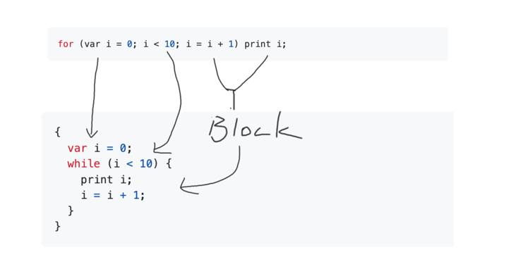

_GLox is an interpreter for a toy language "Lox" based on Go._

Not finished yet...
 - [x] Scanner
 - [x] Parser
 - [ ] Interpreter
   - [x] Expression
   - [x] Variable
   - [x] Statement
   - [x] Scoop
   - [x] Control flow
     - [x] if-else
     - [x] logic operation
     - [x] loop
   - [ ] Function

---




```lox
for (var a=0; a<10; a=a+1) {
    print a;
}

{
    var a = 0;
    while (a < 10) {
        {
            print a;
        }
        a = a + 1
    }
}
```